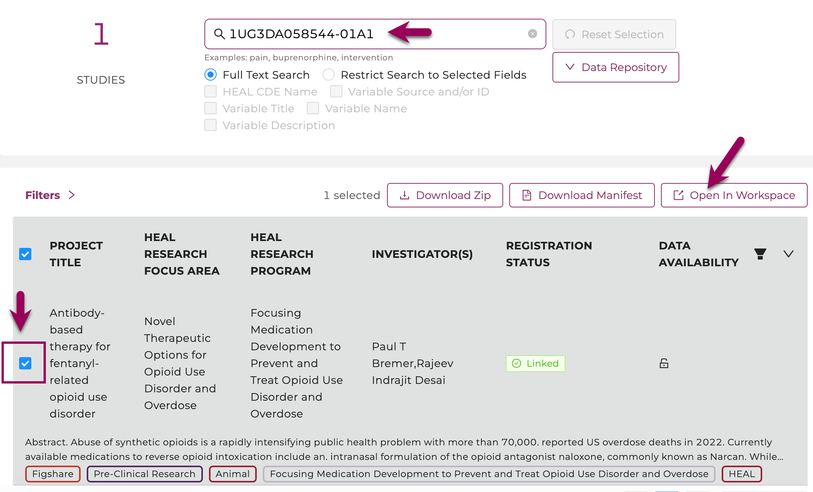
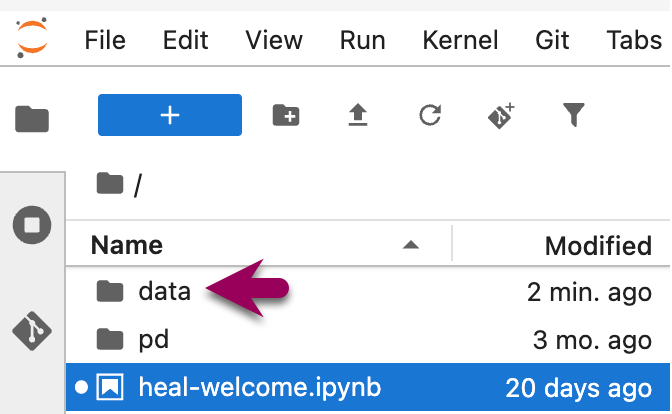
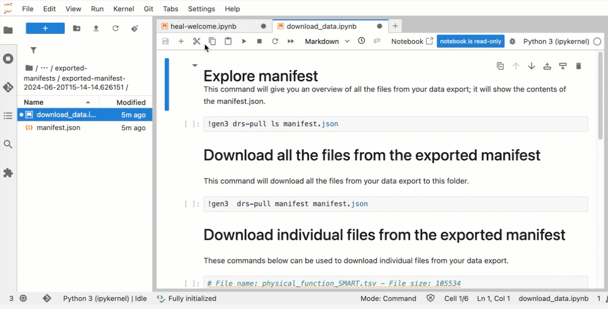

<!-- ---
hide:
  - navigation
--- -->

# Data File Downloads

Users can download data files associated with a study by downloading the files directly from the Discovery page, or if the file size exceeds 250 MB, leveraging the Gen3 Python software development kit (Gen3 SDK) or the Gen3-client tool.

Note that accessing data files requires linked access to all FAIR enabled repositories, [as described here](platform_request_access.md#linking-access-to-fair-enabled-repositories). A pop-up window will remind users:

{: style="height:250px"}

Users are reminded to link the account to all other FAIR enabled repositories, [as described here](platform_request_access.md#linking-access-to-fair-enabled-repositories), to ensure they have maximum access to data available for download.

## Download Data Files Locally

### Download Data Files from the Discovery Page to Local Storage

Users can download data files up to sizes of 250 MB directly from the Discovery Page to their local storage (i.e., their computer).  

1.  Navigate to the [Discovery Page](platform_discovery_page.md). Link your accounts to FAIR repositories as described [here](platform_request_access.md#linking-access-to-fair-enabled-repositories).  
      
    
2.  Find the study of interest by using the [search features](platform_discovery_page.md#search-features) or the [list of accessible studies](platform_discovery_page.md#find-accessible-datasets).  
      
    
3.  Select the clickable box next to the study.  
    Click on "Download ZIP", which will initiate the data download.  
    
    
    
    Select the study and click "Download ZIP".
    
4.  Users will be prompted with a window that shows the download is being prepared.  
    Please do not navigate away from this page until the download is complete.  
    
    {: style="height:200px"}
      
    
5.  Users will be notified once the download is ready. If the download doesn't start automatically, please follow the link provided.  

    {: style="height:250px"}
      
6.  If the file size exceeds 250 MB, users will be notified to deselect studies to reduce the size or use other tools:  
    {: style="height:200px"}
    
    Users are advised to use other tools to download the files if the total file size exceeds 250 MB.  
    
      
To download data files larger than 250 MB, users should use the either the [Gen3-Client command line tool](#download-using-the-gen3-client) (preferred) or the [Gen3 Python SDK](#download-using-the-gen3-python-sdk), both developed by the University of Chicago’s Center for Translational Data Science.  

### Download using the Gen3-Client

For data download operations involving many files and/or very large files, we recommend using the Gen3-Client. It includes a flag to `-skip-completed`, which will continue downloading at the point it left off if the download fails or stalls for any reason.

Here is a guide to download data files using the Gen3-Client:

#### Create a manifest of data files

1.  Log in to the HEAL Platform at <https://healdata.org/portal/login>. Link your accounts to FAIR repositories [as described here](platform_request_access.md#linking-access-to-fair-enabled-repositories).  
    
2.  Find and select one or multiple studies of interest on the [Discovery Page](https://healdata.org/portal/discovery). For multiple studies, select "Data Availability" in the top right corner, click “Available”, and choose multiple studies.
  
3.  Click on the button “Download Manifest".

    
     
#### Create and download HEAL Data Platform API key

1.  On the [Profile Page](https://healdata.org/portal/identity), click "Create API key" to create an API key.  

    
        
2. There will be a pop-up window that shows the API key (masked) and gives you the option to download it. Download the API key as a json file. Note the directory where where you save the API key on your local machine for later use.
    
    
    
#### Download and configure the Gen3-Client

 1. Follow the [download instructions for the Gen3-Client here](https://docs.gen3.org/gen3-resources/tools/data-client/#installation). The client can be [downloaded from here](https://github.com/uc-cdis/cdis-data-client/releases/latest).  
   
 2. In your terminal, configure your profile using the following command:  
   
    Regardless of the operating system, your profile is configured with some version of this command:
     
    ```shell title="Generic Gen3-Client profile configuration"
    gen3-client configure --profile=<desired_profile_name> --cred=<path_to_credentials.json> --apiendpoint=<api_endpoint_url_no_end_slash>`
    ```
 
    Select the tab corresponding to your OS for customized profile configuration instructions.
     
    === "Mac"  
     
        **Gen3-Client profile configuration for Mac:**   
        
        > *By default, Mac OS will install the Gen3-Client in the `Applications` directory unless otherwise directed. If you directed install into a different directory, replace `/Applications` in the command below with the relevant directory. If you added the path to your Gen3-Client binary file to your $PATH variable as [described in the installation instructions](https://docs.gen3.org/gen3-resources/tools/data-client/#mac-os-x-installation-instructions), you do not need to prepend the gen3-client commands with `/Applications` (i.e., you can use `gen3-client configure...` instead of `/Applications/gen3-client configure...`)*  
        
        ```bash title="Mac Gen3-Client profile configuration"
        /Applications/gen3-client configure --profile=heal   --cred=~/Downloads/credentials.json --apiendpoint=https://healdata.org
        ```
    
    === "Windows"
     
        **Gen3-Client profile configuration for Windows:**   
        
        ```ps title="Windows Gen3-Client profile configuration"
        gen3-client configure --profile=heal   --cred=C:\Users\demo\Downloads\credentials.json --apiendpoint=https://healdata.org/
        ```
     
    === "Linux"
     
        **Gen3-Client profile configuration for Linux:**   
        
        ```bash title="Linux Gen3-Client profile configuration"
        gen3-client configure --profile=heal   --cred=~/Downloads/credentials.json --apiendpoint=https://healdata.org
        ```
    
    If the command was succesful, you should get the following output:

    ```Profile 'heal' has been configured successfully.```
     
     
    > If you instead get `Error occurred when validating profile config: Invalid credentials for apiendpoint`, it means there is a problem with the endpoint you entered or (more likely) your credentials. API keys are only valid for 30 days. Check the exipiration date of your credentials on the [Profile Page](https://healdata.org/portal/identity), and check whether there are typos in the apiendpoint or the path to your credentials. For further troubleshooting, refer to the [instructions found here](https://docs.gen3.org/gen3-resources/tools/data-client/#configure-a-profile-with-credentials).  
     
     
 3. Download files by using the following command, which references the [manifest file name you downloaded from the Discovery page](#create-a-manifest-of-data-files) and its location:  
     
     ```bash
     gen3-client download-multiple --profile=<profile_name> --manifest=<manifest_file> --download-path=<path_for_files>
     ```
     For example:
     ```bash
     gen3-client download-multiple --profile=heal --manifest=manifest.json --download-path=downloads
     ```
     
     
     ```bash 
     2021/06/03 16:48:46 Reading manifest...   200 B / 200 B [===================] 100.00% 0s  
     WARNING: flag "rename" was set to false in "original" mode, duplicated files under "downloads/" will be overwritten   
     Proceed? [y/n]:
     ```

     Type `y` to proceed.
     
     Output:

     ```bash
     2021/06/03 16:48:47 Total number of GUIDs: 1   2021/06/03 16:48:47 Preparing file info for each file, please wait...   1 / 1 [============================================] 100.00% 0s   2021/06/03 16:48:47 File info prepared successfully   arcos_all_washpost.tsv.gz 6.41 GiB / 6.41 GiB [=======================================================] 100.00% 0s
     ```

### Download using the Gen3 Python SDK


Here is a guide to download data files using the Gen3 SDK:

#### Create a manifest of data files

1.  Log in to the HEAL Platform at <https://healdata.org/portal/login>. Link your accounts to FAIR repositories [as described here](platform_request_access.md#linking-access-to-fair-enabled-repositories).  
    
2.  Find and select one or multiple studies of interest on the [Discovery Page](https://healdata.org/portal/discovery). For multiple studies, select "Data Availability" in the top right corner, click “Available”, and choose multiple studies.
  
3.  Click on the button “Download Manifest".

    
     
#### Create and download HEAL Data Platform API key

1.  On the [Profile Page](https://healdata.org/portal/identity), click "Create API key" to create an API key.  

    {: style="height:125px"}
        
2. There will be a pop-up window that shows the API key (masked) and gives you the option to download it. Download the API key as a json file. Note the directory where where you save the API key on your local machine for later use.
    
    {: style="height:400px"}
    
#### Install the Gen3 SDK

  >Note: Since this is a Python SDK, you must have Python installed on your machine, version 3.13 or higher. Select the appropriate tab below for your OS for instructions to check whether you have Python installed.  
  
=== "Mac"  
    
    **Check for Python version on Mac:**   
    
    1. Open your terminal. (To do this, you can press **Command + Spacebar**, type `terminal`, and press **Enter** to open Terminal.)
    2. Type the following command and press **Enter**:
    
    ```bash
    python3 --version
    ```
    
    If you get a version number like Python 3.x.x, Python is installed! Verify your version is at least 3.13.x or higher.  

=== "Windows"
    
    **Check for Python version on Windows:**   
    
    1. Open the Command prompt. (To do this, you can press the **Windows Key**, type `cmd`, and press **Enter** to open Command Prompt.)
    2. Type the following command and press **Enter**:
    
    ```DOS
    python --version
    ```
    
    If you get a version number like Python 3.x.x, Python is installed! Verify your version is at least 3.13.x or higher.    

=== "Linux"
    
    *If you're a Linux user, you likely know how to check for your Python version already.*   

**To install the Gen3 Python SDK:**

In your terminal/command line, install Gen3 Python SDK by typing `pip install gen3` and press **Enter**.  

#### Use the Gen3 SDK to download data files from a manifest

Get the paths to your [API key (downloaded previously)](#create-and-download-heal-data-platform-api-key-1) and your [manifest (downloaded previously)](#create-a-manifest-of-data-files-1).  

In the terminal or command prompt, run the following, replacing the creds and manifest values with your path to these files:

```bash
creds='<path-to-your>/credentials.json'
endpoint='healdata.org'
manifest='<path-to-your>/manifest.json'
```

To see what files are in the manifest before downloading them, run this:

```bash
gen3 --endpoint ${endpoint} --auth ${creds} drs-pull ls ${manifest}
```

To download all the files in the manifest, run this:

```bash
gen3 --endpoint ${endpoint} --auth ${creds} drs-pull manifest ${manifest}
```

## Send Data Files Directly to Workspaces

Instead of downloading files locally and uploading them to the workspace, users can download data files directly to the workspaces, as described below.  

1.  Log in to the HEAL Data Platform at <https://healdata.org/portal/login>. Link your accounts to FAIR repositories [as described here](platform_request_access.md#linking-access-to-fair-enabled-repositories).  
      
    
2.  Find and select one or multiple studies of interest on the [Discovery Page](https://healdata.org/portal/discovery). *Select "Data Availability" in the top right corner and click on “Available” to see all studies with data available.* Click "Open in Workspace".   
      
    {: style="height:400px"}  
      
    
4.  Select a workspace image and click "Launch".  
    {: style="height:400px"}
      
5.  Your exported data manifest is in the `/data` folder, found in the navigation panel on the left after launching a workspace (see figure below). Open `/data` --> `/healdata.org` --> `/exported_manifests`. Find the folder with the timestamp corresponding to when you sent the data to the workspace from the Discovery page. When you open the appropriate manifest folder, it contains a `manifest.json` file and a `download_data.ipynb` Jupyter notebook. Double-click the notebook file to open it.  
    {: style="height:200px"}

6.  In the opened notebook, there are commands to list the files in the manifest and to download the data files into your workspace. To run these commands, click the cell with the command you want to run, then click the triangle icon at the top of the notebook. The gif below shows what to click, and demonstrates the data files in the directory after they are downloaded.  
    
    * Note: If you do not want to download all of the files, you can use the commands at the bottom of the notebook to only download selected files. (This is not shown in the gif.)  
    
    
    
