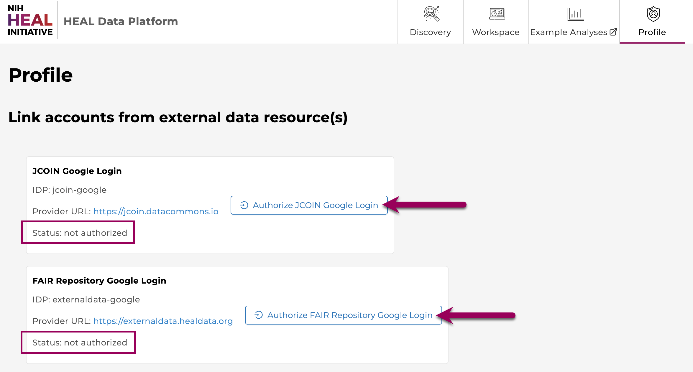
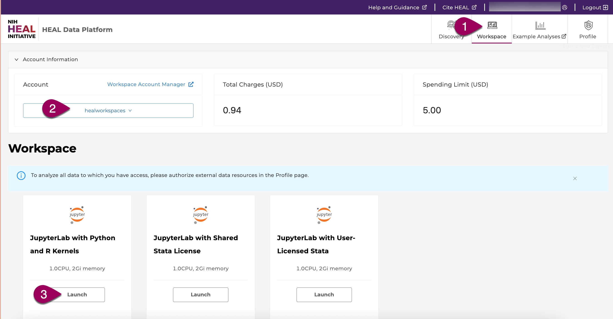
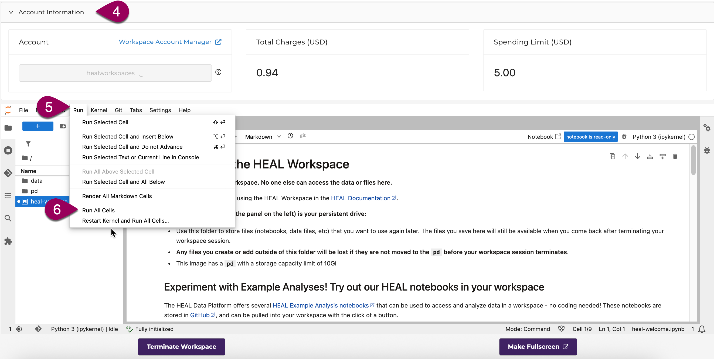
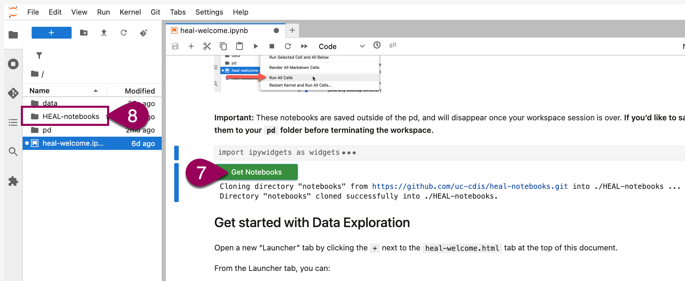

# Example Analyses

[The Example Analyses page](https://uc-cdis.github.io/heal-notebooks-pages/) contains a collection of view-only tutorial Jupyter Notebooks that provide demo analyses of datasets published on the HEAL platform.

## Why tutorial Notebooks?

These notebooks will allow users to learn how to analyze and visualize data available on the HEAL platform - without having to take the additional steps of finding and exporting the data used by the tutorial first.

> All tutorial notebooks are available to view and download on the [Example Analysis page](https://uc-cdis.github.io/heal-notebooks-pages/).  
> You can run, interact with and edit the notebooks in [HEAL workspaces](https://healdata.org/portal/workspace).  
> Find below a description of how to [work with the tutorials in the workspaces](#using-notebooks-in-a-heal-workspace).  

These tutorial notebooks are meant to:

* Give users a sense for how the platform can be used to analyze data.
* Bring complementary datasets together.
* Be used as a launching point for the users’ own custom analysis.
* Spark imagination about how users can incorporate the platform data access, analysis, and collaboration tools into their own research and data analysis process and pipelines.

The “Example Analyses” tab will be regularly updated with new and exciting tutorial data analysis notebooks, as more datasets are published and brought together in novel ways on the Platform.

## Using Notebooks in a HEAL Workspace

### Log in to the HEAL Data Platform

Log in by clicking on the Profile tab or the Login link in the upper right corner. *[See more detailed instructions here.](logging-in.md)*

### Authorize any relevant external data resources in the Profile tab

To maximize access to all data for which you are permitted access, be sure to first authorize the external data resources in the Profile tab. Once you authorize these resources, it lasts for 29 days. You can then see whether your authorization is still active for each external resource on the Profile tab.  

### Launch a workspace

To launch a HEAL workspace, click on the Workspace tab (#1). If prompted, select a paymodel from the dropdown (#2). Click the Launch button for the JupyterLab with Python and R Kernels (#3).  

### Pull all example notebooks into the workspace

If you want to maximize screen space for viewing the workspace, you can click Account Information in the upper right corner (#4) to collapse that section.

Upon launching, the workspace will open a welcome notebook with information about using HEAL workspaces. To generate a button that will let you pull all the example analysis notebooks into your workspace, open the "Run" menu (#5) and select "Run all cells" (#6).  

You can then scroll up to find the green button (#7). Click the button to pull the example analysis notebooks into your workspace in a new folder called `HEAL-notebooks`.  

  

You can open any notebooks in this folder and run them to see the example analyses. [You can learn more about using the HEAL workspace here.](/workspaces/heal_workspaces.md)  

## Download notebooks for local analysis  

If you prefer to work in a different computational environment from the HEAL workspace, you can also download all of the tutorial notebooks from the [GitHub page](https://github.com/uc-cdis/heal-notebooks/tree/main/notebooks) for your preferred use.  
