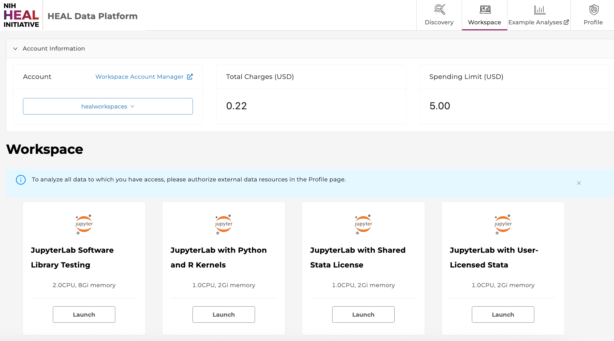
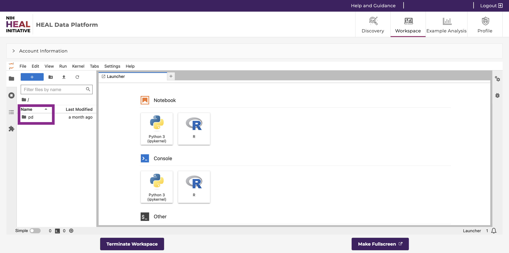
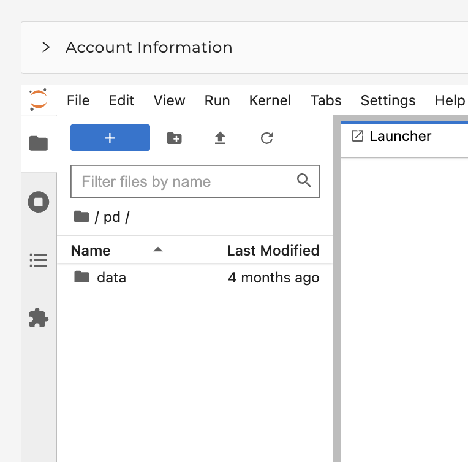
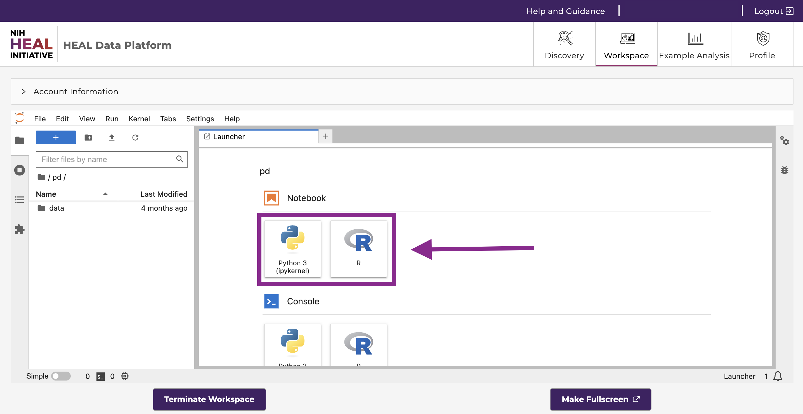
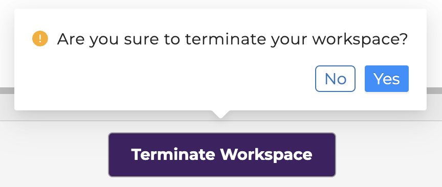
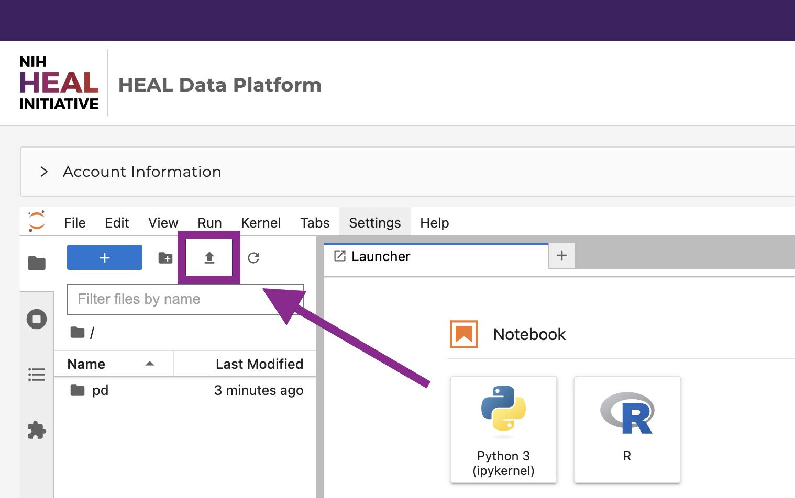
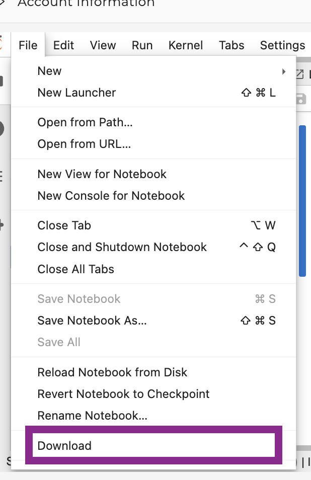
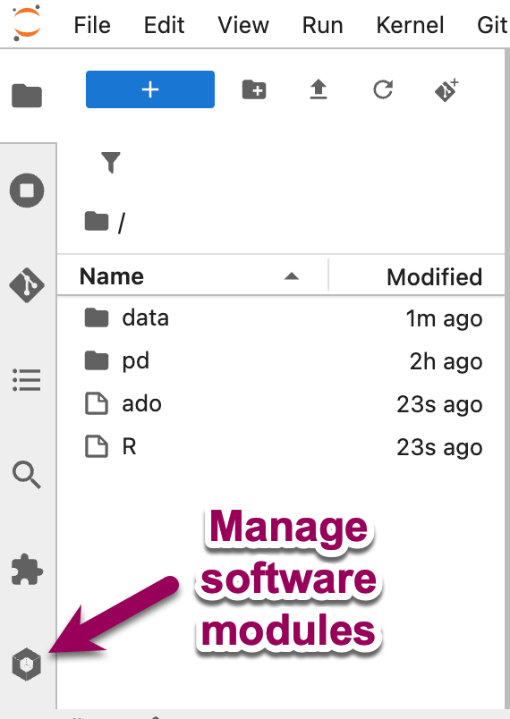
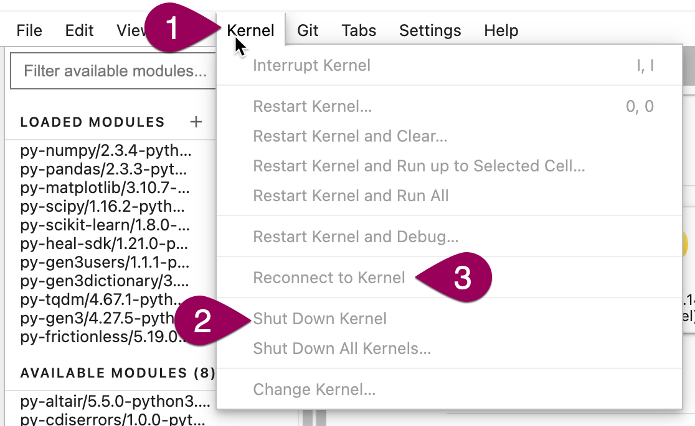

# Using Workspaces on the HEAL Data Platform

!!! info
      To use workspaces, you must first register for workspace access as described on the [Workspace Registration page](heal_workspace_registration.md).
<!--
Workspaces are secure data analysis environments in the cloud that can access data from one or more data resources in the HEAL Data Ecosystem. By default, workspaces include Jupyter notebooks, Python and R, but can be configured to host virtually any application, including analysis workflows, data processing pipelines, or data visualization tools.

> New to Jupyter? Learn more about the popular tool for data scientists on [Jupyter.org](https://jupyter.org/) (disclaimer: CTDS is not responsible for the content). -->

## Guidelines to get started in Workspaces

Once you have access to workspaces, use this guide below to get started with analysis work in workspaces.

1. Log in via [https://healdata.org/portal/login](https://healdata.org/portal/login) to access workspaces.

2. After navigating to [https://healdata.org/portal/workspace](https://healdata.org/portal/workspace), you will discover a list of pre-configured virtual machine (VM) images, as shown below.

      

      * **JupyterLab with Software Library:** This workspace VM is suitable for use with Python notebooks. If you just exported data from one or multiple studies from the Discovery Page and want to start your custom analysis with Python, select this VM. To facilitate your data analysis, it has a collection of Python software packages pre-installed and ready for import, and you can install additional packages. If you have your own Stata license, you can use it in this workspace VM.  
      * **JupyterLab with Python and R Kernels:** This workspace VM is suitable for use with R and Python notebooks. If you just exported data from one or multiple studies from the Discovery Page and want to start your custom analysis with R, select this VM. You can install R packages for analysis.  
      * **JupyterLab with Shared Stata License:** For users who do not have their own Stata license but wish to do Stata analyses in the workspace, we provide a limited shared license in this VM.

3. Click “Launch” on any of the workspace options to spin up a copy of that VM. The status of launching the workspace is displayed after clicking on “Launch”. Note: Launching the VM may take several minutes.

      

4. After launching, the home folder is displayed. One of these folders is your persistent drive ("/pd").

      

5. Select the /pd folder. New files or licenses should be saved in the the /pd directory if users need to access them after restarting the workspaces. Only files saved in the /pd directory will remain available after termination of a workspace session.

      {: style="height:400px"}

      - **Attention:** Any personal files in the folder “data” will be lost. Personal files in the directory /pd will persist.
      - Do not save files in the "data" or “data/healdata.org” folders.
      - The folder “healdata.org” in the “data” folder will host the data files you have exported from the Discovery Page. Move these files to the /pd directory if you do not want to have to export them again.
      - /pd has a capacity limit of 10GB.

6. Start a new notebook under “Notebook” in the Launcher tab. Click the tiles in the launcher and choose between Python 3 or R Studio (where available) as the base programming language.

      *Note: You can open and run multiple notebooks in your workspace; however, each workspace workspace image is a  separate Docker images. There is no functionality to combine them.*

      

7. **Experiment away!** Code blocks are entered in cells, which can be executed individually or all at once. Code documentation and comments can also be entered in cells, and the cell type can be set to support Markdown.

      Results, including plots, tables, and graphics, can be generated in the workspace and downloaded as files.

8. Do not forget to terminate your workspace when you are done with your session. Unterminated workspaces can continue to accrue computational costs. **Note: workspaces automatically shut down after 60 minutes of [idle time](#automatic-workspace-shutdown).**

{: style="height:200px"}

Further reading: read more about how to download data files into the Workspaces [here](../downloading_files.md).

## Upload, Save, and Download Files/Notebooks

You can **upload** data files or Notebooks from your local machine to the home directory by clicking on “Upload” in the top left corner. Access the uploaded content in the Notebook (see below).

You can then **save** the notebook by clicking "File" - "Save as", as shown below.

{: style="height:400px"}

You can then **download** notebooks by clicking "File" - "Download", as shown below. Download the notebook, for example, as ".ipynb".

{: style="height:400px"}

## Analysis Tools Available in the HEAL Workspace

### Environments, Languages, and Tools

The following **environments** are available in all the workspace VMs:

- Jupyter Lab

{: style="height:100px"}

The following **programming languages** are available in Jupyter Notebooks:

- Python 3
- R (in some workspace VMs)

The following **tools** are available in Jupyter Notebooks:

- GitHub ([read GitHub documentation](https://docs.github.com/en))

### Python 3 and R in Jupyter

Both Python 3 and R are available in Jupyter Notebooks that have an R kernel.

Basic Python or R packages, such as PyPI or CRAN, as well as many tools typical for data analysis are already included in the base workspace images without further installation required. For Python and R, users can start a new notebook with one of the tiles under "Notebook", as shown below.

### Workspace Software Library

The HEAL Workspace Software Library includes a wide variety of analytic and data management software that are pre-installed and ready to use. This includes up-to-date versions of commonly-used third-party packages for analytic systems such as Python and R^(*)^. Together, these will satisfy the needs of many analysts.  

*\* R is not yet available in the software library workspace, but will be soon.*  

To see what software is available, you can click the gear wheel icon at the bottom of the left sidebar (see screenshot below). There, you will see a list of software packages that have been pre-loaded (i.e., ready for use) at the top of the list, as well as additional modules that are installed and available for loading below.  

{: style="height:350px"}

#### Loading and Unloading Modules for use in the Workspace

You can click the software modules icon (shown in the screenshot above) to view what modules are pre-loaded, load additional modules, and unload modules. Use the search bar at the top to filter available modules. For any module in the library, it **must be loaded before it can be used** within Python or R.  

If you already have a notebook or console open and you change the list of loaded modules (either by loading additional modules or unloading any), these changes do not take effect until you have shut down and reconnected to the kernel. To do that: Click on the `Kernel` menu in the menu bar at the top of the workspace and select `Shut Down Kernel`. After the shutdown completes, select `Reconnect to Kernel` in order to relaunch and connect to a new kernel. Note that using `Restart Kernel` (in the `Kernel` menu) is not sufficient to activate the change.  

{: style="height:250px"}

#### Installing Additional Modules

If there is a piece of software you would like to use that has not been pre-installed, you can usually install the software yourself. Examples of additional software you may want to install include Python or R packages. Install the software into your `home` directory (for temporary use) or persistent drive (`/pd`; for use across multiple workspace sessions) using the installation procedures appropriate for the type of software. For example, you may use `pip install` to add additional Python packages (if you're installing from within a notebook, use `!pip install`).  

Note: Software that you install yourself will not appear on the list of loaded modules in the software library; they do not need to be loaded before using them. However, you can always investigate what Python packages are installed but not shown in the list of loaded modules with `pip list` (or, if you're running in a notebook, `!pip list`). This will show all modules that are not shown in the Loaded Modules list (including any you installed) but are available for import.  

## Automatic Workspace Shutdown

**Warning:** When a HEAL Workspace reaches the STRIDES Credits limit for STRIDES Credits Workspaces, or reaches the Hard Limit for STRIDES Grant Workspaces, the Workspace will be automatically terminated. Please be sure to save any work before reaching the STRIDES Credit or Hard Limit.

**Warning:** Workspaces will also automatically shut down after 90 minutes of idle time. A pop-up window will remind users to navigate back to the workspaces page in order to save the data.

<!-- Links and Images -->

